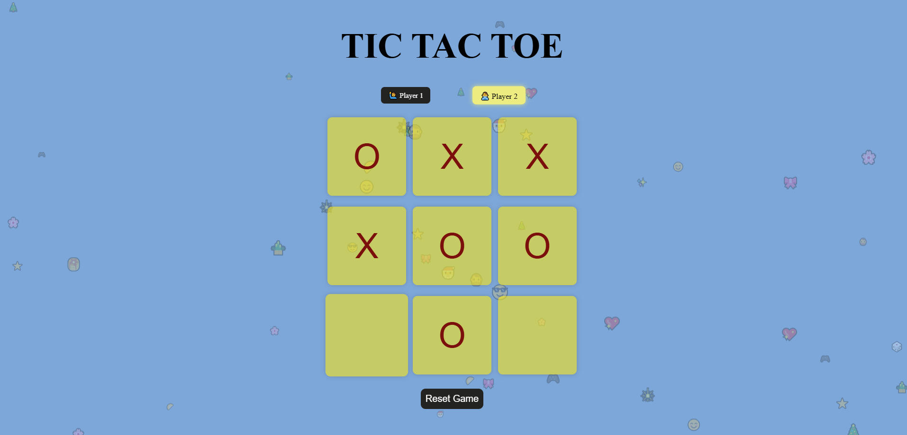

# 🎮 Tic Tac Toe Game

A modern and interactive **Tic Tac Toe** game built with clean, efficient code and an intuitive user interface. This project recreates the classic two-player strategy game while emphasizing simplicity, responsiveness, and an enjoyable user experience.

## 📸 Preview

## ✨ Features

* 🎯 Two-player gameplay (Player X vs Player O)
* 🏆 Automatic winner detection
* 🤝 Draw detection when no moves remain
* 🔄 Restart/New Game functionality
* 📱 Responsive and user-friendly interface
* ⚡ Fast and lightweight implementation

## 🛠️ Technologies Used

* HTML5
* CSS3
* JavaScript

## 🚀 How to Play

1. Start the game.
2. Players take turns placing **X** and **O** on the 3×3 grid.
3. The first player to align **three symbols** horizontally, vertically, or diagonally wins.
4. If all cells are filled without a winner, the game ends in a draw.
5. Click **Restart** or **New Game** to play again.

## 📂 Project Objective

This project was developed to strengthen fundamental web development skills, including **DOM manipulation, event handling, game logic, state management, and responsive UI design**. It serves as an excellent beginner-friendly project while demonstrating clean coding practices and interactive frontend development.

## 🌟 Future Improvements

* Play against an AI opponent
* Scoreboard to track wins
* Multiple difficulty levels
* Sound effects and animations
* Dark/Light theme support

---

If you found this project helpful, consider giving it a ⭐ on GitHub!
